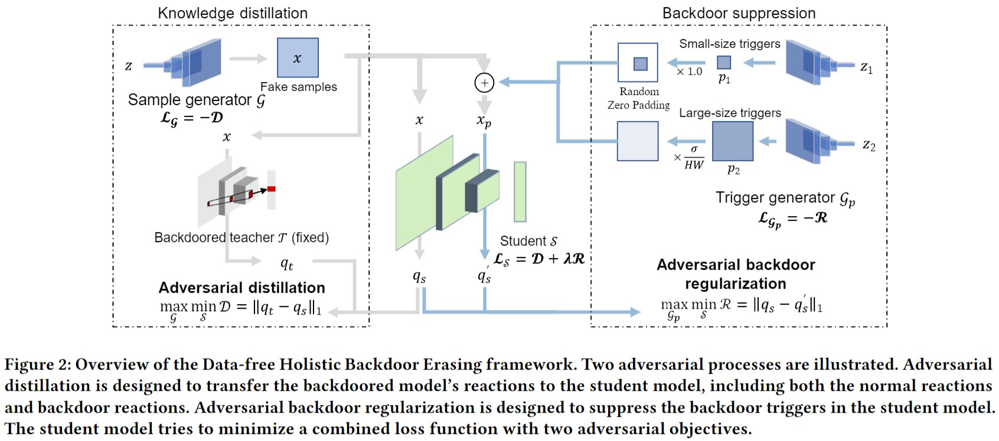

# DHBE: Data-free Holistic Backdoor Erasing in Deep Neural Networks via Restricted Adversarial Distillation
This repository is an official implementation of the AsiaCCS 2023 paper "DHBE: Data-free Holistic Backdoor Erasing in Deep Neural Networks via Restricted Adversarial Distillation"





## Step 1: Train a Backdoored model

```
python train_teacher_badnets.py \
    --dataset cifar10 \
    --trigger_name  tri1_3x3 \
    --target_class 9 
```

After training, the backdoored model and the training log files are placed under folder "train_teacher_badnets_cifar10_resnet18_e_200_tri1_3x3_t9_0_0_n300_results".

Then, for backdoor erasing with DHBE, just run the DHBE_train.py script and use this path as the "input_dir" augment:

## Step 2: DHBE backdoor erasing.

```
python DHBE_train.py \
    --dataset cifar10 \
    --input_dir ./train_teacher_badnets_cifar10_resnet18_e_200_tri1_3x3_t9_0_0_n300_results \
    --epochs 300 \
    --epoch_iters 50 \
    --lr_S 0.1 \
    --lr_G 0.001 \
    --lr_Gp 0.001 \
    --loss_weight_d1 0.1 \ 
    --loss_weight_tvl1 0.0 \
    --loss_weight_tvl2 0.0001 \
    --patch_size 5 \
    --nz 256 \
    --nz2 256 \
    --vis_generator

```


## Contact 
For any questions, please contact zhicongy@sjtu.edu.cn


